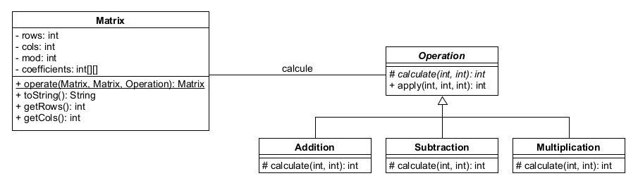
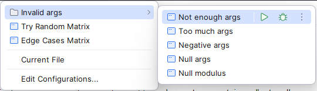

Aude Laydu, Jacobs Arthur

# Rapport Labo 5 Matrices

/!\ Les images dans le Markdown ne s'exportent pas correctement dans le pdf. Elles sont dans le zip.

## 1. Choix de conception et hypothèses

### Choix de conception

Nous avons décidé de créer une classe `Operation` qui contient deux méthodes : `calculate` et `apply`. Chaque
opération (addition, soustraction, multiplication) est implémentée sous la forme d'une sous-classe qui étend `Operation`
et implémente la méthode `calculate`. La méthode `apply` prend deux entiers et un module en paramètre, appelle
`calculate` avec ces deux entiers, et retourne le résultat modulo le module.
Ce système permet d'étendre facilement le programme avec de nouvelles opérations en ajoutant de nouvelles sous-classes
qui étendent `Operation` et implémentent la méthode `calculate`. Le modulo sera automatiquement appliqué à la fin de
l'opération.

La classe `Matrix` implémente la création de matrices à partir de valeurs ou de dimensions, en effectuant les
vérifications nécessaires. Elle contient également la méthode `operate` qui prend deux matrices et une opération en
paramètre, et retourne la matrice résultante de l'opération.

### Hypothèses

- Si l'utilisateur crée une matrice en donnant les valeurs et que certaines d'entre elles ne sont pas comprises entre 0
  et mod - 1, elles seront automatiquement prises modulo mod.
- Pour les erreurs causées par les opérations, nous lançons une RuntimeException avec un message approprié : l'erreur
  vient du programmeur.
- Nous ne fournissons pas les méthodes .add, .subtract et .multiply dans Matrix car nous voulons que le programme soit
  aussi flexible que possible. Ainsi, un autre programmeur pourrait ajouter une autre opération en créant une nouvelle
  classe qui étend Operation et implémente la méthode calculate. (même si nous aurions pu fournir les méthodes .add,
  .subtract et .multiply et permettre l'accès à operate, cela ne serait pas aussi propre)
- Nous estimons que l'utilisateur ne va pas utiliser des entiers qui sont trop grands pour les opérations d'addition ou
  de multiplication (ce qui provoquerait un dépassement de capacité)

## 2. Diagramme UML



## 3. Tests

Nous avons développé deux programmes de tests : EdgeCases.java et RandomMatrix.java.

### EdgeCases.java

Ce programme teste les cas limites et les erreurs que nous avons prévues :

- Les matrices nulles
- Les opérations sur des matrices avec des modules différents
- Les matrices avec des dimensions invalides (par exemple, une matrice 3x3 avec une ligne de longueur 2)
- La taille de la matrice résultante est celle de la plus grande matrice utilisée dans l'opération

Pour chaque test, nous affichons "[PASSED]" si le test a réussi et "[FAILED]" si le test a échoué. Tous les tests ont
affiché PASSED lors de nos tests, validant les cas limites auxquels nous avons pensé.

Voici la sortie du programme :

```text
[PASSED] Test null matrix 1
[PASSED] Test null matrix 2
[PASSED] Test null matrix 3
[PASSED] Test null matrix 4
[PASSED] Test different modulus 1
[PASSED] Test different modulus 2
[PASSED] Test invalid matrix size 1
[PASSED] Test invalid matrix size 2
[PASSED] Test invalid matrix size 3
[PASSED] Test bigger size is kept 1
[PASSED] Test bigger size is kept 2
[FAILED] Test bigger size is kept 3
```

### RandomMatrix.java

Ce programme teste les opérations sur des matrices dont les valeurs sont aléatoires. La taille des matrices et le
modulos sont passés en paramètres du programme.
Si tout fonctionne correctement, le programme affiche les matrices et le résultat des opérations.

En cas d'erreurs causées par des paramètres invalides (donc causées par l'utilisateur), nous ne lançons pas d'exception
mais nous affichons un message d'erreur et fermons le programme, ceci afin d'être plus user-friendly.

Pour tester plus facilement les cas limites de ce programme, nous avons créé de multiples configurations de tests. Voilà
les cas testés :

- Cas normal (_Try Random Matrix_):
    - Affichage des matrices
    - Addition de deux matrices
    - Soustraction de deux matrices
    - Multiplication de deux matrices
- Arguments invalides (_Invalid Arguments_/*):
    - Trop peu d'arguments
    - Trop d'arguments
    - Un argument n'est pas un nombre ou est négatif
    - Un argument ou le module est nul

<br>



## 4. Code